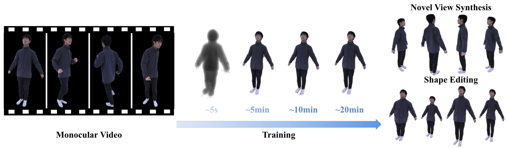

# IntrinsicNGP: Intrinsic Coordinate based Hash Encoding for Human NeRF

PyTorch implementation of the paper "IntrinsicNGP: Intrinsic Coordinate based Hash Encoding for Human NeRF". This repository contains the training and inference code, data.

**|[Project Page](https://ustc3dv.github.io/IntrinsicNGP/)|[Paper](https://arxiv.org/abs/2302.14683)|**

We proposed IntrinsicNGP, an effective and efficient novel view synthesis method for human performers based on the neural radiance field. 

## Code 
Coming Soon!

